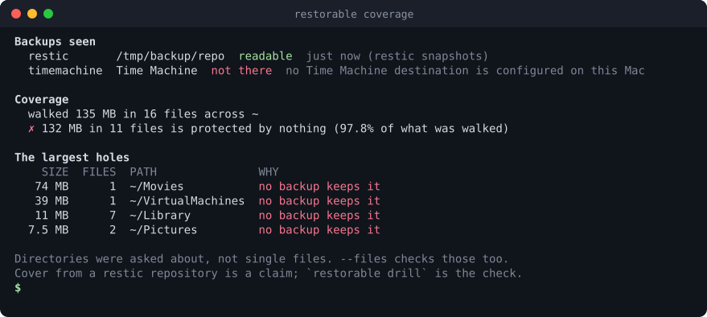
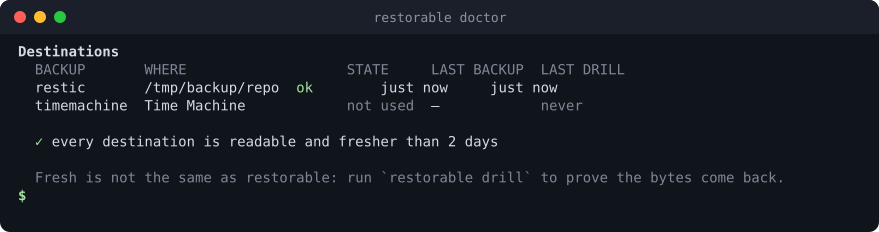
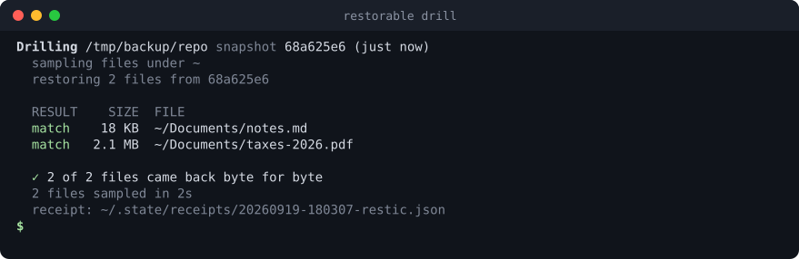

# restorable

**Is this machine actually backed up? What here is protected by nothing, when each backup last ran, and whether a restore really hands the bytes back.**

<p align="center"></p>

Most backup tools tell you that they ran. That is not the same as knowing your
files are safe: a folder can sit outside every include list for years, a disk can
quietly stop being written to, and a repository can hold data that no longer
restores. `restorable` answers the three questions your backup tool does not.

- **`coverage`** walks your files and lists what no backup keeps — with the reason, when the system gives one.
- **`doctor`** says when each destination last completed, where that date came from, and what is wrong.
- **`drill`** restores a random sample into a temporary directory and compares it, byte for byte, with what is on disk.

It reads Time Machine and [restic](https://restic.net). It is a single Go binary
for macOS and Linux, and it never writes to your backups.

## Contents

- [Install](#install)
- [Quick start](#quick-start)
- [A tour](#a-tour)
- [Configuration](#configuration)
- [Getting help](#getting-help)
- [Command reference](#command-reference)
- [What it touches](#what-it-touches)
- [Limits](#limits)
- [License](#license)

## Install

```sh
go install github.com/morass/restorable/cmd/restorable@latest
```

Or from a checkout:

```sh
go build -o ~/.local/bin/restorable ./cmd/restorable
```

Make sure `~/.local/bin` is on your `PATH`. To read a restic repository you need
`restic` installed; Time Machine needs nothing but macOS.

## Quick start

```sh
restorable doctor      # is every backup readable and recent?
restorable coverage    # what here is protected by nothing?
restorable drill       # prove a restore really works
```

Nothing has to be configured first: `restorable` reads Time Machine on a Mac and
the restic repository your shell already points at through `RESTIC_REPOSITORY`.

## A tour

### 1. What is protected by nothing

```sh
restorable coverage                  # your home directory
restorable coverage ~/Documents      # one place
restorable coverage --min-size 100MB # only the holes worth acting on
```

It walks the directories, asks every destination whether it covers each one, and
lists the largest places nothing keeps. A directory is a hole when no backup
claims it, or when a backup claims it and excludes it — and then the exclusion is
explained as far as the system allows:

<p align="center"></p>

Add `--files` to ask about individual files as well, `--all` to include the
folders macOS guards behind a permission prompt, and `--strict` to exit non-zero
when anything is unprotected, which is what you want from a scheduled run.

### 2. Whether the backups are readable and recent

```sh
restorable doctor
restorable doctor --stale-after 24h
```

<p align="center"></p>

Each row says where the date came from, because on a Mac it can come from the
mounted backup disk, from Time Machine's own record, or only from a local
snapshot — and those mean different things. A destination that is configured but
not plugged in reads as **not connected**: it may have a recent backup on it, but
it is not keeping anything today. `doctor` exits 1 when anything is
wrong, so it fits in a cron job or a login script.

### 3. Proof that a restore works

```sh
restorable drill                 # sample the newest snapshot
restorable drill --count 40      # sample more files
restorable drill --keep --target /tmp/drill
```

<p align="center"></p>

The sampled files are restored into a directory the drill makes for itself and
hashed against the live copies. A file you edited after the snapshot is reported
as **changed**, not as a failure; a file whose bytes differ although nothing
edited it, or that the backup will not hand back at all, is a **failure** and
exits 1. If nothing could be compared — everything sampled was edited, deleted or
unreadable — the drill says so and does not call that a pass.

The sample comes from your home directory inside the snapshot; `--path` picks
another part of it.

Every drill writes a receipt, so the machine keeps a track record instead of one
good day:

```sh
restorable history
```

## Configuration

`restorable` works with no configuration. A file adds repositories and changes
what `coverage` walks:

```sh
restorable config --write    # write an example you can edit
restorable config --path     # where it lives
restorable config            # what is in effect right now
```

```json
{
  "roots": ["~"],
  "stale_after_hours": 48,
  "restic": [
    {
      "name": "backup disk",
      "repo": "/Volumes/backup/restic",
      "password_command": "security find-generic-password -s restic-backup -w"
    }
  ]
}
```

`password_command` is your own command that prints the passphrase — the same one
you give restic. `restorable` runs it, hands the result to restic, and never
stores it. The file is created with mode `600` and is refused if other users can
read it.

## Getting help

```sh
restorable help              # the commands
restorable help drill        # one command: what it does, examples, flags
restorable drill --help      # the same
```

## Command reference

| Command | What it does |
|---|---|
| `restorable coverage [path...]` | List what no backup keeps, largest first. `--json`, `--strict`, `--min-size`, `--files`, `--all`, `--depth`, `--cross-filesystems` |
| `restorable doctor` | Whether each destination is readable and recent. `--stale-after`, `--json`. Exits 1 on any problem |
| `restorable drill` | Restore a sample and compare the bytes. `--dest`, `--path`, `--count`, `--seed`, `--max-size`, `--target`, `--keep`, `--json`. Exits 1 on any failure |
| `restorable history` | Past drills, newest first. `--limit`, `--json` |
| `restorable backends` | Which backup systems can be read here, and what they cover |
| `restorable config` | Where the configuration lives, and an example. `--path`, `--example`, `--write` |
| `restorable version` | The version |

## What it touches

- **It reads your backups. It never writes to them.** No repository is ever
  modified, locked, pruned or repaired, and a drill only ever restores into a
  temporary directory, which it removes unless you pass `--keep`.
- **Your files are read, never copied anywhere.** `coverage` reads names and
  sizes; a drill reads the sampled files to hash them. Nothing leaves the machine.
- **It writes two things**: receipts under `~/.local/state/restorable/`
  (or `$XDG_STATE_HOME`), and the configuration file you asked for, both mode `600`.
  Receipts hold paths, sizes and hashes — never file contents.
- **It runs the tools you already have**: `tmutil` and `plutil` on macOS, `restic`
  for a restic repository, each with a fixed environment and a deadline.
- On macOS some folders (Photos, Mail, Messages and a few more) are guarded by the
  system; they are skipped and named in the report unless you pass `--all`, which
  may make macOS ask for permission. Time Machine's record of the last completed
  backup is behind Full Disk Access; without it, an unmounted destination can only
  be dated from a local snapshot, and the report says so.

## Limits

- **Claiming is not holding.** `coverage` answers from what a destination covers
  and excludes, which is fast and can be wrong if a backup silently failed for one
  file, or if it was told to exclude something restic does not record. That is what
  `drill` is for.
- A restic repository says what it covers through the paths of **this machine's**
  snapshots; a shared repository full of another host's files covers nothing here.
- When a destination claims a path but cannot be asked whether it keeps it, the
  report says the answer is **unknown** rather than guessing either way.
- By default it asks about **directories, not single files**; `--files` is slower
  and catches files excluded by hand.
- It reads **Time Machine and restic** today. A Time Machine drill needs the
  backup disk mounted.
- **Exclusion reasons are best effort.** `tmutil` says *whether* a path is
  excluded, not *why*; the common cases (caches, trash, temporary files, the
  sticky per-item flag) are named, the rest are reported honestly as unexplained.
- A drill samples; it does not restore everything. Sampling proves the repository
  hands files back — a full restore test is still a full restore test.

## License

MIT. See [LICENSE](LICENSE).
